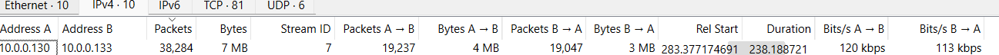

## Incident Report - PsExec Hunt

## Scenario
An IDS alert flagged suspicious lateral movement activity on the network. 
The task was to analyze a PCAP file to identify how the attacker moved 
laterally using PsExec, what machines were compromised, and what credentials 
or shares were abused during the attack.

- File type: PCAP
- Protocol of interest: SMB2
- Tool used by attacker: PsExec
- Investigation focus: Lateral movement, admin shares, NTLM authentication

## Tools Used
- Wireshark
- VirusTotal
- MITRE ATT&CK Navigator

## Investigation Steps
1. Opened a PCAP file gotten from cyberdefenders to analyze a an IDS alert that was flagged
because there was a suspicion of lateral movement activity on the network.
2. Navigated to statistics, then to conversation to identify top talkers and to determine attacker and victim IPs
3. Filtered the traffic with this smb2 and ip.addr == 10.0.0.130.
4. Looked at the traffic and found a file that was being copied in the info section in wireshark. It showed [TCP ACKed unseen segment] Write Response, File: PSEXESVC.exe
5.  Wrote a structured finding for each event.

## Findings
1. On Oct 11, 2023 at 07:42:08 UTC, source IP 10.0.0.130 initiated an SMB2 connection to destination IP 10.0.0.133 on port 445. PSEXESVC.exe was written to \10.0.0.133\ADMIN$ via a Write Request over SMB2. This maps to MITRE ATT&CK technique T1021.002 - Remote Services: SMB/Windows Admin Shares. This indicates the attacker copied the PsExec service binary onto the victim machine to enable remote code execution.
      

3. On Oct 11, 2023 07:46, source IP 10.0.0.130 Attacker attempted to authenticate using account IEUser on 10.0.0.131 (HR-PC) on port 49703 It resulted in an access denial; STATUS_ACCESS_DENIED - authentication failed This maps to MITRE ATT&CK technique T1021.002 — Remote Services: SMB/Windows Admin Shares. This indicates that, the attacker wanted to compromise the HR-PC after compromising the SALES-PC

## MITRE ATT&CK Techniques Identified
| Activity | Technique ID | Technique Name |
|----------|-------------|----------------|
| Lateral Movement |T1021.002  | Remote Services: SMB/Windows Admin Shares |
| Stolen credentials | T1078| Valid Accounts |

## Indicators of Compromise (IOCs)
- PSEXESVC.exe; PsExec service binary written to \\10.0.0.133\ADMIN$
- Attacker IP: 10.0.0.130
- Victim IP: 10.0.0.133
- HR-PC IP: 10.0.0.131
- Credentials attempted: IEUser
- Credentials used on SALES-PC: ssales
- Victim hostname: SALES-PC

## Conclusion

The attacker first compromised the Sales-PC using the technique of lateral movement. The attacker used PsExec over SMB2 to move laterally and installed PSEXESVC.exe. The attacker copied the PsExec service binary onto the victim machine to enable remote code execution, then tried gaining access to the HR-PC but the authentication failed because of wrong credentials. the attacker was able to gain remote access to the victim's PC using the PsExec tool in windows

## What This Taught Me About SOC Work
- Seeing PsExec activity running from a SALES-PC rather than an IT admin machine is an indicator that the SALES-PC has been compromised. PsExec should only be run by administrators not end-user workstations. 
- attackers will normally like to hide their operations using legitimate tools in the operating system. 
- An IOC must be something that stands out as abnormal. 
