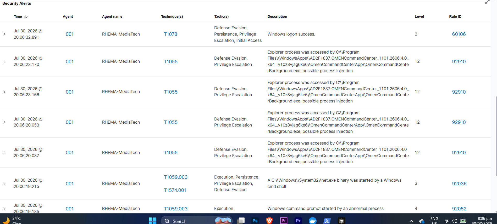

# Wazuh SIEM Deployment — SOC Analyst Lab

## Overview

Wazuh is an open-source security platform that combines three capabilities in one;
1. SIEM: Collects, aggregates, and analyzes logs from multiple sources
2. EDR: Monitors endpoints for threats — file changes, process creation, network connections.
3. XDR: Correlates data across endpoints, networks, and applications

## Architecture
- Deployment type: Single-node
- Platform: Docker on Windows
- Components deployed:
  - Wazuh Manager
  - Wazuh Indexer
  - Wazuh Dashboard
- Agent: Windows endpoint (RHEMA-MediaTech)

## Deployment Steps
1. Open your terminal and run this command first; ( docker --version ). this is checks the version of docker you have installed.
2. run this command to check Docker Compose is also installed ( docker compose version ). this displays the currently installed version of the Docker Compose command-line tool on your system
3. Clone the Wazuh Docker repository ( git clone https://github.com/wazuh/wazuh-docker.git -b v4.7.3 )
4. navigate into the cloned directory ( cd wazuh-docker )
5. When you run ls, you'll see two modes. 
- ( single-node; deploys one Wazuh instance. Good for home labs and learning )
- ( multi-node deploys multiple instances for high availability. Used in enterprise environments )
for this lab, we will use the single node.
6. Navigate into the single-node folder: cd single-node
7. Generate the SSL certificates by running this command; docker compose -f generate-indexer-certs.yml run --rm generator
8. Wazuh will pull large Docker images: docker compose up -d
9. verify everything is running properly: docker ps

## Agent Configuration
I made some changes in the agent configuration because wazuh was not receiving logs from sysmon. 
- i opened this C:\Program Files (x86)\ossec-agent\ossec.conf and opened the notepad as administrator and added the configuration below in the <localfile> header,

<localfile>
    <location>Microsoft-Windows-Sysmon/Operational</location>
    <log_format>eventchannel</log_format>
</localfile>

## Screenshots
### Dashboard Overview

### Live Alerts

### Agent Connected

## Alert Triage — Initial Observations
Document the first alerts you saw and your triage decision for each.

| Alert | MITRE Technique | Severity | Triage Decision | Reasoning |
|-------|----------------|----------|----------------|-----------|
| | | | | |

## What This Taught Me About SOC Work
- 
- 
- 

## Next Steps
What you plan to do next with this SIEM setup.
