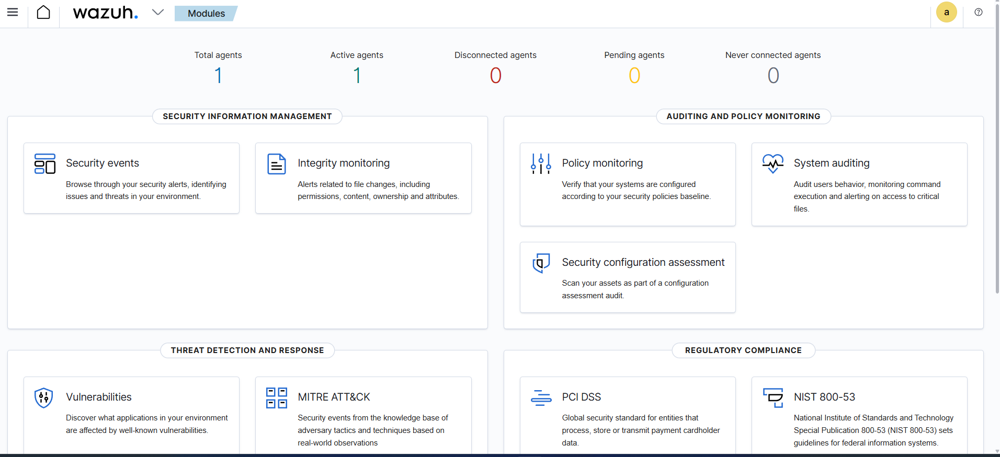
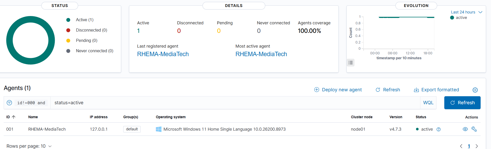
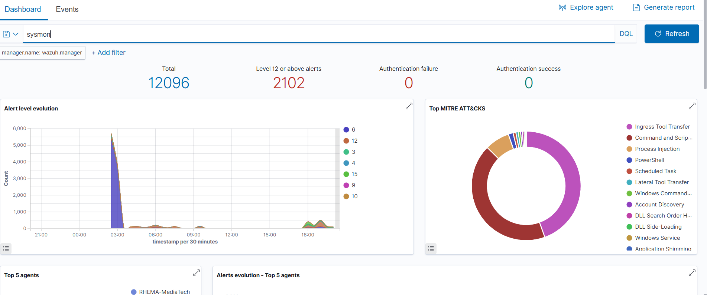

# Wazuh SIEM Deployment - SOC Analyst Lab

## Objective
I deployed Wazuh, connected a Windows agent, ingested Sysmon logs, and investigated alerts.

## Overview

Wazuh is an open-source security platform that combines three capabilities in one;
1. SIEM: Collects, aggregates, and analyzes logs from multiple sources
2. EDR: Monitors endpoints for threats — file changes, process creation, network connections.
3. XDR: Correlates data across endpoints, networks, and applications

## Architecture
- Deployment type: Single-node
- Platform: Docker on Windows
- Components deployed:
  - Wazuh Manager
  - Wazuh Indexer
  - Wazuh Dashboard
- Agent: Windows endpoint (RHEMA-MediaTech)

## Log Ingestion Path
1. Sysmon creates events on Windows
2. Agent reads Microsoft-Windows-Sysmon/Operational via eventchannel
3. Agent sends them to Wazuh Manager
4. Alerts appear in the Wazuh Dashboard

## Deployment Steps
1. Open your terminal and run this command first; ( docker --version ). this checks the version of docker you have installed.
2. run this command to check Docker Compose is also installed ( docker compose version ). this displays the currently installed version of the Docker Compose command-line tool on your system
3. Clone the Wazuh Docker repository ( git clone https://github.com/wazuh/wazuh-docker.git -b v4.7.3 )
4. navigate into the cloned directory ( cd wazuh-docker )
5. When you run ls, you'll see two modes. 
- ( single-node; deploys one Wazuh instance. Good for home labs and learning )
- ( multi-node deploys multiple instances for high availability. Used in enterprise environments )
for this lab, we will use the single node.
6. Navigate into the single-node folder: cd single-node
7. Generate the SSL certificates by running this command; docker compose -f generate-indexer-certs.yml run --rm generator
8. Wazuh will pull large Docker images: docker compose up -d
9. verify everything is running properly: docker ps lists all currently running Docker containers

## Agent Configuration
I made some changes in the agent configuration because wazuh was not receiving logs from sysmon. 
- i opened this C:\Program Files (x86)\ossec-agent\ossec.conf and opened the notepad as administrator and added the configuration below in the <localfile> header,

```xml
<localfile>
  <location>Microsoft-Windows-Sysmon/Operational</location>
  <log_format>eventchannel</log_format>
</localfile>
```
- Then restarted the Wazuh agent service.
  
## Screenshots
### Dashboard Overview


### Live Alerts


### Agent Connected


### Sysmon alerts


## Alert Triage — Initial Observations
1. T1087 — A net.exe account discovery command was initiated
   The net user command was ran and that was being detected automatically
2. T1059.001 — Powershell executed script from suspicious location
   PowerShell activity being flagged
3. T1105 — Executable file dropped in folder commonly used by malware - Level 15
   The Wazuh agent installation dropped executable files onto your machine.
   That's what triggered the Level 15 alert. It's a false positive; a legitimate action that looks suspicious to the detection rule because it matches the pattern of malware behavior.

## Alert Investigations
- [node.exe FP triage](Alert%20Investigation%20-%20node.exe.md)
- [Cursor → Explorer T1055 FP triage](Alert%20Investigation%20-%20cursor-explorer.md)
- [MoUsoCoreWorker.exe loaded taskschd.dll (T1053.005 FP)](Alert%20Investigation%20-%20mousocoreworker-taskschd.md)
- [pool_tags_summary.json.dup (Sysmon EID11)](Alert%20Investigation%20-%20pool-tags-summary.md)
- [Wazuh Detection Tuning - Cursor.exe / Rule 92910](wazuh-detection-tuning.md)
- [Wazuh Custom Detection - cmd.exe spawned whoami.exe (T1033)](wazuh-custom-detection-whoami.md)
- [local_rules.xml](local_rules.xml)

  ## Alert Summary
| Alert | MITRE Technique | Severity | Triage Decision | Reasoning |
|-------|----------------|----------|----------------|-----------|
| Telegram.exe accessing Explorer process | T1055 | 12  | false positive| Process Injection fires when one process accesses another process's memory. That's a technique malware uses to hide inside legitimate processes. |
| OMEN Command Center accessing Explorer process | T1055 | 12 | false positive | Process Injection fires when one process accesses another process's memory. That's a technique malware uses to hide inside legitimate processes |
| Executable file dropped in malware folder | T1105 | 15 | False positive | Wazuh agent installation dropped legitimate executables triggering the rule |

## What This Taught Me About SOC Work
- SOC analysts need to tune detection rules reducing false positives so real threats don't get buried in noise.
- A high severity alert does not automatically mean a real threat. Context determines everything.
- Wazuh out of the box doesn't see everything. It needs Sysmon to get deep process visibility.


